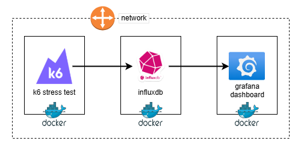

# Grafana K6

Stress test using grafana/k6 with docker.

## Architecture



## Network

Before any container run, create shared network.

```bash
# Create a network to test
docker network create stresstest
```

## InfluxDb

The first container must be influxdb (version 2), to have data ingested.

```bash
# Pull influxdb image
docker pull influxdb:2

# Run on port 8086
docker run -d --network=stresstest --name=influxdb2 -p 8086:8086 influxdb:2
```

Then access UI and run the "get started" on browser to configure it.

## K6 Test

To send data to influxdb version 2, a pluggin is needed on k6, so we need to create k6 binary with this plugin (xk6).

```bash
# Generate xk6 build
docker build -f Dockerfile-build -t k6-build .
# Build k6 image
docker build -t k6-test .
# Run test and save to influxdb
docker run --rm --network=stresstest --env-file=.env --name=k6-test -i -v $PWD:/app k6-test
```

Also, there is the `Dockerfile-out-json` to run standalone with results locally only.

## Grafana

Using grafana open source (to use enterprise use image `grafana/grafana-enterprise`).

```bash
# Pull grafana image
docker pull grafana/grafana-oss
# Run grafana locally
docker run -d --network=stresstest --name=grafana -p 3000:3000 grafana/grafana-oss
```

Then access UI (user/pass: admin) and set a new password.

Configure datasource influxdb:

- URL: `http://influxdb2:8086`;
- Set only "With credentials" flag on Auth session;
- Set header "Authorization" with influxdb token in format "Token [influxdbtoken]".<br> Ex: `Authorization: Token xyz_abc==`

With grafana configured, [download k6 dashboard here][k6-dashboard] and import it in "Dashboards->New->Import".

## References

- Influxdb on docker: [influx-docker][influx-docker]
- Grafana configurations: [grafana-configs][grafana-configs]
- Grafana dashboards: [grafana-dashs][grafana-dashs]
- K6 grafana dashboard: [k6-dashboard][k6-dashboard]

<!-- Refereces -->

[influx-docker]: https://medium.com/@techworldthink/installing-influxdb-v2-with-docker-on-ubuntu-39a974c3cb40
[grafana-configs]: https://grafana.com/docs/grafana/latest/setup-grafana/configure-grafana/
[grafana-dashs]: https://grafana.com/grafana/dashboards/
[k6-dashboard]: https://grafana.com/grafana/dashboards/2587-k6-load-testing-results/
